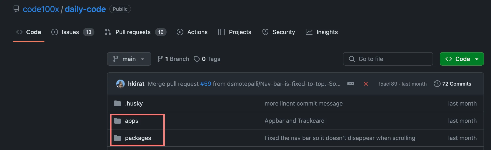
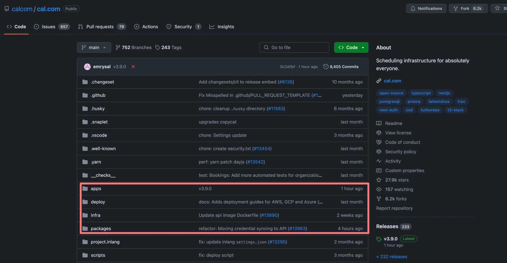

# Monorepos 🚀

## 1. What are Monorepos? 🤔

As the name suggests, a **monorepo** is a single repository (e.g., on GitHub) that holds all your **frontend**, **backend**, and **DevOps** code.

### Few repos that use monorepos are:

- [https://github.com/code100x/daily-code](https://github.com/code100x/daily-code)
  
- [https://github.com/calcom/cal.com](https://github.com/calcom/cal.com)
  

### Do You Need to Know Monorepos as a Full-Stack Engineer? 🧑‍💻

- **Not exactly!** Most of the time, monorepos are already set up by the DevOps or tools engineer.
- You just need to **follow the right practices** when working in such an environment.
- However, it's **good to know** how to set one up from scratch for deeper understanding.

---

## 2. Why Monorepos? ❓

### Why Not Simple Folders? 📂

You can use simple folders if:

1. 🛠️ **Services are highly decoupled** (they don't share any code).
2. 🔗 **Services don’t depend on each other**.

**Example:** A project with:

- A **Golang service**
- A **JavaScript service**

In such cases, simple folders might suffice.

### Why Use Monorepos? 🤩

1. **Shared Code Reuse** 🛡️: Easily share libraries or utilities across services.
2. **Enhanced Collaboration** 🤝: Makes teamwork more streamlined.
3. **Optimized Builds and CI/CD** ⚡:
   - Tools like **Turborepo** offer smart caching and task execution strategies.
   - This significantly reduces build and testing times.
4. **Centralized Tooling and Configuration** 🛠️:
   - Manage build tools, linters, formatters, and configurations centrally for the entire project.

---

## Common Monorepo Frameworks in Node.js 🌐

Here are some popular frameworks and tools:

1. **[Lerna](https://lerna.js.org/)**
2. **[Nx](https://github.com/nrwl/nx)**
3. **[Turborepo](https://turbo.build/)** (Not exactly a monorepo framework, but provides excellent build optimizations.)
4. **[Yarn/npm Workspaces](https://classic.yarnpkg.com/lang/en/docs/workspaces/)**

---

## Why Turborepo? 💡

We’ll focus on **Turborepo** because:

- 🏎️ It's the **most relevant tool today**.
- 💼 It provides advanced features like **build optimizations** that others might lack.

---

### Happy Coding! 🎉
